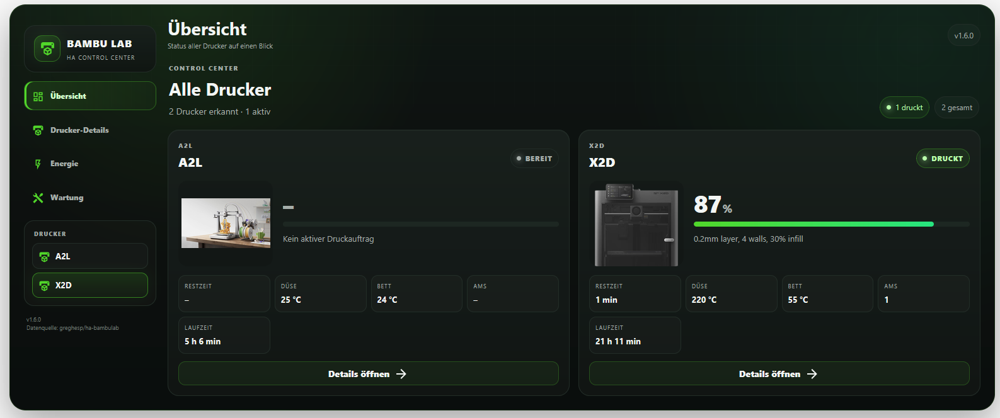

# Bambu Lab Dashboard for Home Assistant

Eigenständiges Mehrdrucker-Control-Center für Home Assistant. Die Karte nutzt ausschließlich die Geräte, Entitäten und Services der Home-Assistant-Integration [greghesp/ha-bambulab](https://github.com/greghesp/ha-bambulab). Zusätzliche Bambu-Lovelace-Karten sind nicht erforderlich.

<p align="center">
  
</p>


## Wichtig: Schreibzugriffe und „nur Licht geht“

`greghesp/ha-bambulab` dokumentiert selbst eine Firmware-/Autorisierungsbeschränkung von Bambu Lab: Lesefunktionen bleiben erhalten, aber im Cloud-/Hybrid-Betrieb können die meisten Schreibfunktionen fehlen. Für ältere Hybrid-Firmwares nennt die Integration ausdrücklich den Fall, dass **nur das Licht steuerbar bleibt**. Für volle Schreibzugriffe verlangt die Integration LAN Mode plus Developer LAN Mode. Das Dashboard kann diese Sperre nicht umgehen und zeigt diese Einschränkung direkt im Steuerbereich an.

Plugin-Hinweis: https://github.com/greghesp/ha-bambulab/blob/main/docs/index.mdx


## Modellabhängige Wartung

Das Dashboard übernimmt das von `ha-bambulab` gemeldete Druckermodell und wählt automatisch das dazugehörige Bambu-Lab-Wartungsprofil. Unterstützt werden die aktuell von der Integration gelisteten Modelle **A1, A1 mini, A2L, P1P, P1S, P2S, H2C, H2D, H2D Pro, H2S, X1, X1C, X1E und X2D**.

Wartungsintervalle werden **nicht zwischen Modellen übertragen**. Ein Kalendertermin wird nur berechnet, wenn für das erkannte Modell ein verifiziertes Herstellerintervall hinterlegt ist. Gibt Bambu für eine Aufgabe nur „regelmäßig“, „nach Zustand“ oder eine firmwareseitige/HMS-Erinnerung vor, erfindet das Dashboard keine Tageszahl. Neue oder unbekannte Modelle erhalten einen sicheren allgemeinen Fallback, bis ein verifiziertes Herstellerprofil ergänzt wurde.

Die Gesamtlaufzeit ist nur Information und löst keine Wartung aus. Hersteller-/HMS-Hinweise, sichtbare Verschmutzung und Verschleiß haben immer Vorrang.

## Installation

1. HACS → Dashboard → Benutzerdefinierte Repositories.
2. `https://github.com/theonix77/Bambulab-Dashboard` als Typ **Dashboard** hinzufügen.
3. Installieren und Browser mit `Strg+F5` neu laden.
4. Karte hinzufügen oder YAML verwenden:

```yaml
type: custom:bambu-lab-dashboard
```

## Funktionen in v1.8.3

- Mehrere Bambu-Drucker automatisch erkennen.
- Übersicht mit Status, Fortschritt, Restzeit, Temperaturen, AMS-Anzahl und Gesamtlaufzeit.
- Endzeit des aktiven Druckauftrags in der Übersicht, automatisch erkannt oder über `end_time_entity` manuell zugeordnet.
- Druckerbilder ausschließlich proportional skalieren (`object-fit: contain`, keine Verzerrung).
- Dark / Light / automatisch nach Home Assistant.
- Druckbild/Cover groß in der Detailansicht.
- Kamera mit Diagnose der tatsächlichen `camera.*`-Entity.
- AMS und einzelne Slots/Spulen mit Detailansicht.
- Aktives Filament aus `active_tray` bzw. aktivem Tray/ExternalSpool, inklusive Farbe und Restwert, sofern die Integration diese Daten meldet.
- Echte Steuerung über die von `ha-bambulab` bereitgestellten Domains:
  - `button`: Pause, Fortsetzen, Stop, Buzzer
  - `select`: Druckgeschwindigkeit (`printing_speed`), ggf. Airduct-Modus
  - `number`: Solltemperaturen Düse/Bett/Kammer
  - `fan`: Bauteil-, Aux-, Kammer- und weitere Lüfter
  - `light`: Kammerlicht
  - `switch`: Kamera-/Bildmodus und Hinweistöne, sofern vorhanden
- Optionales zweites `light.*`-Licht pro Drucker, im Karteneditor über ein Dropdown auswählbar und in den Quick Controls als „Licht 2“ steuerbar.
- Optionaler Idle-Shutdown-Helper (`input_boolean`), in den Quick Controls mit Timer-Status und EIN/AUS-Anzeige steuerbar.
- Externe Smart-Steckdose als `switch.*` pro Drucker, inklusive EIN/AUS und Sicherheitsabfrage beim Ausschalten während eines Drucks.
- Leistungs- und Energiesensoren frei zuordnen.
- Wartungsplan pro Drucker mit quittierbaren Aufgaben und Wartungsbuch.
- Offizielle Wartungsquelle pro Aufgabe anklickbar; responsive Popup-Ansicht mit direktem Original-Link.

## Steuerung: genaue Zuordnung zum offiziellen Plugin

Das Dashboard ordnet Steuerungen nicht anhand beliebiger Namen zu, sondern nach **Domain + `translation_key`/Unique-ID** aus dem kompletten Gerätebaum des Druckers.

| Funktion | `ha-bambulab` Entity |
|---|---|
| Pause | `button` / `pause` |
| Fortsetzen | `button` / `resume` |
| Stop | `button` / `stop` |
| Druckgeschwindigkeit | `select` / `printing_speed` |
| Düse Soll | `number` / `target_nozzle_temperature` |
| Bett Soll | `number` / `target_bed_temperature` |
| Kammer Soll | `number` / `target_chamber_temperature` |
| Bauteillüfter | `fan` / `cooling_fan` |
| Aux-Lüfter | `fan` / `aux_fan` |
| Kammerlüfter | `fan` / `chamber_fan` |
| Licht | `light` / `chamber_light` |
| Airduct-Modus | `select` / `airduct_mode` |

Wenn diese Entities im Plugin wegen Firmware-/Hybrid-Beschränkung nicht erzeugt werden, kann das Dashboard sie nicht schalten. Stattdessen erscheint ein Diagnosehinweis mit `hybrid_mode_blocks_control`, `developer_lan_mode` und `mqtt_encryption`.

## Kamera

Das Dashboard verwendet die vom jeweiligen Drucker über `ha-bambulab` bereitgestellte `camera.*`-Entity. Bei RTSP-fähigen Modellen wird der Home-Assistant-Kamera-Proxy verwendet; bei anderen Modellen die von der Integration bereitgestellte Kameraquelle. Zusätzlich zeigt das Dashboard Entity, Home-Assistant-Status und Tokenstatus an. Wenn die Integration selbst kein nutzbares Kamerabild liefern kann, kann auch das Dashboard kein Livebild erzeugen. Über „In Home Assistant öffnen“ lässt sich dieselbe Kameraentity direkt prüfen.

## Druckerbilder

Für Modelle mit Bild im Projekt `greghesp/ha-bambulab-cards` wird diese Upstream-Bildquelle verwendet. Die Darstellung erfolgt immer mit proportionaler Maximalgröße statt erzwungener Breite/Höhe.

Für den A2L existiert im aktuellen `ha-bambulab-cards`-Repository weiterhin kein eigenes korrektes A2L-PNG. Das Dashboard verwendet deshalb keinen falschen A1-Ersatz. Als Fallback wird ein A2L-Produktbild aus einer offiziellen Bambu-Lab-Veröffentlichung verwendet.

## Gesamtlaufzeit

Die Gesamtlaufzeit wird ausschließlich aus der Bambu-Entity `total_usage_hours` gelesen. Sie wird **nicht** aus der letzten Druckdauer berechnet. Wenn ein Drucker offline ist und die Entity `unavailable` wird, zeigt das Dashboard den zuletzt tatsächlich von `total_usage_hours` gemeldeten Wert aus dem lokalen Cache mit Kennzeichnung „zuletzt gemeldet“.

## Wartung

Die Wartungsseite ist modellabhängig. Das erkannte Modell bzw. die passende Modellfamilie bestimmt Aufgaben, Hinweise, Quellen und – soweit von Bambu eindeutig vorgegeben – Intervalle. Die Quellen verweisen auf offizielle Bambu-Lab-Wartungsunterlagen.

Für Modelle ohne veröffentlichtes festes Kalenderintervall zeigt das Dashboard die Herstelleraufgabe als regelmäßige bzw. zustandsabhängige Wartung an, **ohne eine Frist zu erfinden**. Quittierte Aufgaben und das Wartungsbuch werden weiterhin pro Drucker getrennt gespeichert.

Offizielle Bambu-Lab-Wartungsübersicht: https://bambulab.com/en/support/maintenance

## Wartungsbuch

Das Wartungsbuch zeigt 15 Einträge pro Seite. Es kann nach Wartungsart gefiltert werden; zusätzlich lässt sich die Ansicht auf die letzten 30 Tage begrenzen. Eine kleine Auswertung zeigt Gesamtzahl, Wartungen der letzten 30 Tage und die am häufigsten quittierte Aufgabe. Einzelne Einträge sowie das komplette Logbuch können nach Sicherheitsabfrage gelöscht werden. Das Löschen des Logbuchs ändert bewusst nicht die separat gespeicherten letzten Wartungszeitpunkte und damit auch nicht die nächsten Fälligkeiten.

Nach dem Quittieren einer Wartung erscheint eine sichtbare Bestätigung. Die Wartungs- und Quellenbuttons besitzen Hover-, Active- und Tastatur-Fokuszustände, damit auf Desktop klar erkennbar ist, dass die Aktion ausgelöst werden kann.

## Sprache / Language

Die Dashboard-Oberfläche übernimmt automatisch die Sprache von Home Assistant. Deutsch wird als Deutsch dargestellt; Englisch sowie derzeit nicht separat übersetzte Home-Assistant-Sprachen verwenden Englisch als Fallback. Übersetzt werden Navigation, Übersicht, Druckerdetails, Steuerung, Kamera/AMS, Energie, Wartungsprofile und -hinweise, Wartungsbuch, Popups, Sicherheitsabfragen sowie der Karteneditor. Datumsangaben wechseln ebenfalls zwischen deutschem und englischem Format. Die Entity-Namen und bestimmte Zustände der Bambu-Integration selbst bleiben davon getrennt und richten sich nach Home Assistant bzw. der Integration. Ab v1.8.3 wird diese Abdeckung zusätzlich durch einen eigenen i18n-Test geprüft.

## Smart-Steckdose / Energie

Pro Drucker können im Karteneditor zugeordnet werden:

- Smart-Steckdose: `switch.*`
- Leistung: beliebige `sensor.*`-Entity
- Energie: beliebige `sensor.*`-Entity

Beim Ausschalten der Steckdose während eines aktiven Drucks verlangt das Dashboard eine zusätzliche Bestätigung.

## Validierung

```bash
npm run validate
```

Die Tests prüfen Syntax, Discovery, Entity-Zuordnung, Steuerungs-Rendering, Hybrid-Warnung, aktives Filament und Custom-Element-Registrierung. Ein echter End-to-End-Schaltversuch am physischen Drucker kann nur in der jeweiligen Home-Assistant-Installation erfolgen.

## Lizenz

MIT. Bambu Lab ist eine Marke des jeweiligen Rechteinhabers. Dieses Community-Projekt ist nicht offiziell mit Bambu Lab verbunden.

## Mobile Bedienung

Laufende Home-Assistant-Statusupdates werden während eines aktiven Touch-/Scroll-Vorgangs kurz zurückgestellt, damit die Ansicht auf iPhone/Android nicht springt. Die AMS-Slot-Details öffnen auf Mobilgeräten als vollflächiges responsives Fenster und nicht mehr inline unter der AMS-Liste.
