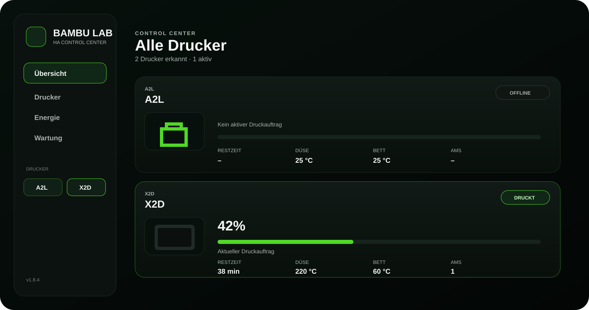

# Bambu Lab Dashboard for Home Assistant



Ein eigenständiges **Mehrdrucker-Control-Center für Home Assistant**. Die Karte zeigt alle über die Bambu-Lab-Integration eingebundenen Drucker gemeinsam in einer Übersicht und öffnet pro Drucker eine Detailansicht mit Druckstatus, Temperaturen, Kamera, Steuerung, AMS, Energie und Wartung.

> **Wichtig:** Dieses Projekt verbindet sich nicht selbst mit Bambu Lab. Die Verbindung zu Cloud/LAN, Drucker und AMS übernimmt die Home-Assistant-Integration [greghesp/ha-bambulab](https://github.com/greghesp/ha-bambulab). Die zusätzlichen Bambu-Lovelace-Karten sind für dieses Dashboard **nicht erforderlich**.

## Was ist neu in v1.2.0?

v1.2.0 fasst die Fehlerkorrekturen aus den realen Home-Assistant-Tests zusammen und erweitert den Editor deutlich:

- Übersicht zeigt **alle Drucker gleichzeitig** in frei festlegbarer Reihenfolge.
- Klick auf eine Druckerkarte oder auf einen Drucker im Umschalter öffnet zuverlässig dessen **Detailansicht**.
- Offline-Drucker zeigen keine veralteten 100-%-Druckwerte mehr als aktiven Auftrag.
- Druckerkarten wurden für schmale Sections neu aufgebaut; Bild und Kennzahlen können sich nicht mehr überlagern.
- Der A2L bekommt **kein falsches A1-Bild** mehr als automatischen Ersatz.
- Pro Drucker kann ein **eigenes Bild** angegeben werden, z. B. `/local/bambu/a2l.png`.
- Leistung und Energie können aus **allen `sensor.*`-Entitäten** gewählt bzw. direkt per Entity-ID eingetragen werden. Smart-Steckdosen-Sensoren werden nicht mehr durch einen engen Filter versteckt.
- AMS-Auswahl zeigt nur echte AMS-Geräte; `ExternalSpool`, Tray- und Cache-Hilfsgeräte werden aus der manuellen AMS-Zuordnung herausgefiltert.
- Status, Fortschritt, Auftrag, Restzeit, Temperaturen, Kamera, Online-Status, Layer und Geschwindigkeit können bei Bedarf **manuell auf konkrete Entities gelegt** werden.
- Die Karte besitzt keine eigene künstliche Maximalbreite mehr.
- Card-Picker-Preview bleibt deaktiviert, damit Home Assistant nicht die komplette Control-Center-Karte in die kleine Vorschau quetscht.

## Architektur

```text
Bambu-Drucker / AMS
        │
        ▼
greghesp/ha-bambulab
        │
        ├─ Geräte + Entitäten
        ├─ Status / Fortschritt
        ├─ Temperaturen / Lüfter
        ├─ Kamera
        ├─ AMS / Filament
        └─ Steuerung
        │
        ▼
Bambu Lab Dashboard
        │
        ├─ Mehrdrucker-Übersicht
        ├─ Drucker-Details
        ├─ AMS-Zuordnung
        ├─ Energie-Zuordnung
        ├─ Entity-Overrides
        └─ Wartung
```

Das Dashboard öffnet **keine eigene MQTT-Verbindung**, meldet sich nicht bei Bambu Lab an und speichert keine Bambu-Zugangsdaten.

## Voraussetzungen

Benötigt werden:

1. [Home Assistant](https://www.home-assistant.io/)
2. [HACS](https://www.hacs.xyz/)
3. [greghesp/ha-bambulab](https://github.com/greghesp/ha-bambulab)
4. mindestens ein bereits über diese Integration eingerichteter Drucker

Nicht erforderlich sind die separaten Bambu-Karten wie AMS Card, Print Control Card, Print Status Card oder Spool Card.

## Installation

### 1. Bambu-Lab-Integration einrichten

Installiere und konfiguriere zuerst [greghesp/ha-bambulab](https://github.com/greghesp/ha-bambulab). Unter **Einstellungen → Geräte & Dienste → Bambu Lab** müssen deine Drucker und ihre Entitäten sichtbar sein.

### 2. Dashboard über HACS installieren

1. **HACS → Dashboard** öffnen.
2. Oben rechts **⋮ → Benutzerdefinierte Repositories**.
3. Repository eintragen: [theonix77/Bambulab-Dashboard](https://github.com/theonix77/Bambulab-Dashboard)
4. Typ **Dashboard** auswählen.
5. Repository hinzufügen und **Bambu Lab Dashboard** installieren.
6. Browser mit **Strg + F5** neu laden.

HACS sollte die Ressource automatisch anlegen. Unter **Einstellungen → Dashboards → Ressourcen** muss sinngemäß vorhanden sein:

```text
/hacsfiles/Bambulab-Dashboard/Bambulab-Dashboard.js
```

Typ: **JavaScript-Modul**.

### 3. Karte hinzufügen

Im Dashboard:

**Dashboard bearbeiten → Karte hinzufügen → Bambu Lab Dashboard**

oder manuell:

```yaml
type: custom:bambu-lab-dashboard
```

Für die Grundfunktion sind keine Drucker- oder Entity-IDs nötig.

## Wichtig zur Breite in Home Assistant

Die Karte kann nur die Breite nutzen, die ihr der **übergeordnete Home-Assistant-View bzw. die Section** gibt. Eine Custom Card kann ihre Section technisch nicht selbst auf zwei oder drei Section-Spalten verbreitern.

Home Assistant teilt jede einzelne Section intern in 12 Karten-Spalten. Der Schalter **Volle Breite** bedeutet deshalb: volle Breite der aktuellen Section, nicht automatisch volle Browserbreite. Siehe [Home Assistant: Sections](https://www.home-assistant.io/dashboards/sections/) und [Custom Card sizing](https://developers.home-assistant.io/docs/frontend/custom-ui/custom-card/).

Für dieses Control Center sind zwei Varianten sinnvoll:

- **Sections-View:** Die Section, in der die Karte liegt, im Section-Editor auf 2 oder 3 Sections Breite stellen. Danach kann die Karte diese komplette Breite nutzen.
- **Panel-View:** Für eine eigene Bambu-Ansicht den View-Typ **Panel** verwenden. Eine Panel-View zeigt eine Karte über die verfügbare View-Breite. Siehe [Home Assistant: Dashboard Views](https://www.home-assistant.io/dashboards/views/).

Die Karte selbst hat seit v1.2.0 kein internes `max-width` mehr.

## Druckererkennung

Die Karte liest Home Assistants Geräte- und Entitätsregistrierung über die WebSocket-API.

Ein Gerät wird nur als Drucker akzeptiert, wenn seine relevanten Entities von `bambu_lab` stammen und typische Druckerwerte vorhanden sind, z. B. Temperatur plus Druckstatus/Fortschritt. HACS-Update-Geräte werden nicht aufgrund ihres Namens als Drucker angenommen.

Für die Zuordnung werden `translation_key`, `unique_id` und weitere stabile Registry-Angaben verwendet. Umbenannte Entity-IDs sind deshalb normalerweise kein Problem.

## Übersicht und Navigation

Die Startansicht zeigt alle sichtbaren Drucker in der im Editor eingestellten Reihenfolge. Pro Drucker werden nur die groben Informationen gezeigt:

- Name und Modell
- Online-/Druckstatus
- aktueller Fortschritt
- aktueller Auftrag
- Restzeit
- Düsen- und Betttemperatur
- Anzahl der zugeordneten AMS-Einheiten

Die komplette Druckerkarte und der Druckerumschalter sind anklickbar und öffnen die Detailansicht des gewählten Druckers.

## Drucker bearbeiten

Im visuellen Karteneditor kannst du pro Drucker festlegen:

- Anzeigename
- Reihenfolge
- anzeigen / ausblenden
- eigenes Druckerbild
- Leistungssensor
- Energiesensor
- AMS anzeigen / ausblenden
- Kamera anzeigen / ausblenden
- Energie anzeigen / ausblenden
- Wartung anzeigen / ausblenden
- manuelle AMS-Zuordnung
- erweiterte Entity-Zuordnung

### Eigenes Druckerbild

Für Modelle ohne korrektes automatisches Bild – aktuell insbesondere den A2L – kannst du ein eigenes Bild verwenden.

Lege die Bilddatei z. B. hier ab:

```text
/config/www/bambu/a2l.png
```

und trage im Karteneditor ein:

```text
/local/bambu/a2l.png
```

Alternativ kann eine direkt erreichbare `https://`-Bildadresse verwendet werden.

## Smart-Steckdose / Energie

Unter **Leistungssensor** und **Energiesensor** sind ab v1.2.0 grundsätzlich alle `sensor.*`-Entities zulässig. Die Eingabefelder unterstützen die vorhandenen Home-Assistant-Sensoren als Vorschläge, akzeptieren aber auch eine direkt eingegebene Entity-ID.

Typische Beispiele:

```text
sensor.meine_steckdose_power
sensor.meine_steckdose_energy
```

Die Karte rechnet `W`, `kW`, `Wh`, `kWh` und `MWh` passend um. Ohne zugeordneten Sensor werden keine Verbrauchswerte erfunden.

## AMS-Zuordnung

Standardmäßig versucht die Karte, AMS-Geräte über die Home-Assistant-Gerätehierarchie (`via_device_id`) automatisch dem jeweiligen Drucker zuzuordnen.

Wenn das nicht korrekt ist, kannst du im Karteneditor echte AMS-Geräte manuell einem Drucker zuordnen. In dieser Liste werden technische Hilfsgeräte wie `ExternalSpool`, einzelne Tray-Geräte und Cache-Geräte bewusst nicht angeboten.

Sobald bei einem Drucker mindestens ein AMS manuell angehakt ist, wird diese manuelle Zuordnung verwendet. Ohne Haken greift wieder die automatische Zuordnung.

## Erweiterte Entity-Zuordnung

Wenn bei einem bestimmten Modell ein Wert falsch erkannt wird, öffne im Drucker-Editor **Erweiterte Entity-Zuordnung**. Dort kannst du die automatisch erkannten Werte gezielt überschreiben:

- Status
- Fortschritt
- Druckauftrag
- Restzeit
- Düsentemperatur
- Betttemperatur
- Online-Status
- Kamera
- Druckbild / Cover
- aktueller Layer
- Layer gesamt
- Geschwindigkeit

Leer lassen bedeutet immer: automatische Erkennung verwenden.

## Updates

Nach einem neuen Commit bzw. einer neuen Version:

1. **HACS → Bambu Lab Dashboard**
2. **⋮ → Neu herunterladen**
3. Browser mit **Strg + F5** neu laden

Die aktuell geladene Version wird innerhalb der Karte angezeigt.

## Fehlerbehebung

Ausführlich: [docs/HELP.md](docs/HELP.md)

Installation: [docs/INSTALLATION.md](docs/INSTALLATION.md)

Architektur: [docs/ARCHITECTURE.md](docs/ARCHITECTURE.md)

Fehler melden: [GitHub Issues](https://github.com/theonix77/Bambulab-Dashboard/issues)

## Datenschutz

Das Dashboard verarbeitet nur Daten, die das angemeldete Home-Assistant-Frontend bereits lesen darf. Für bekannte Modellgrafiken kann eine öffentliche Datei aus [greghesp/ha-bambulab-cards](https://github.com/greghesp/ha-bambulab-cards) geladen werden. Das separate Kartenprojekt muss dafür nicht installiert sein.

## Entwicklung und Validierung

```bash
npm run validate
```

Die automatischen Tests prüfen Syntax, Registrierung, Discovery, Modellbild-Mapping und zentrale Konfigurationsmerkmale. Ein vollständiger Ende-zu-Ende-Test mit jedem Bambu-Modell ist nur in realen Home-Assistant-Installationen möglich.

## Lizenz

MIT. Bambu Lab ist eine Marke des jeweiligen Rechteinhabers. Dieses Community-Projekt ist nicht offiziell mit Bambu Lab verbunden.
